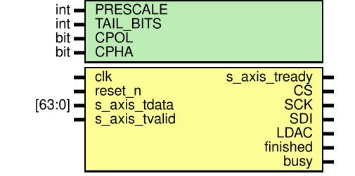

# SPI DAC Driver IP

SPI interface IP for TI DAC7565/DAC8565 quad-channel DACs. Receives four 16-bit DAC values as a single 64-bit word via AXI4-Stream and sequentially outputs SPI frames to update all channels.

## I/O Interface

### Module Parameters

| Parameter | Description | Default |
|-----------|-------------|---------|
| `PRESCALE` | SPI clock divider (SCK freq = clk / PRESCALE) | 2 |
| `TAIL_BITS` | Additional zero bits after data frame | 2 |
| `CPOL` | SPI clock polarity | 0 |
| `CPHA` | SPI clock phase | 1 |

### Input Ports

| Port | Width | Description |
|------|-------|-------------|
| `clk` | 1 | System clock |
| `reset_n` | 1 | Active-low reset |
| `s_axis_tdata` | 64 | DAC data (ChD[63:48], ChC[47:32], ChB[31:16], ChA[15:0]) |
| `s_axis_tvalid` | 1 | AXI-Stream valid signal |

### Output Ports

| Port | Width | Description |
|------|-------|-------------|
| `s_axis_tready` | 1 | AXI-Stream ready signal (low when busy) |
| `CS` | 1 | SPI chip select (active-low) |
| `SCK` | 1 | SPI clock |
| `SDI` | 1 | SPI data output (MOSI) |
| `LDAC` | 1 | DAC load signal (fixed low) |
| `finished` | 1 | Transfer complete pulse |
| `busy` | 1 | Transfer in progress indicator |

## Verification

Verified with post-synthesis functional simulation at 100MHz clock frequency.

**Target Device:** Xilinx Zynq-7030 (xc7z030fbg676-3)

| Resource | Used | Available | Utilization |
|----------|------|-----------|-------------|
| Slice LUTs | 45 | 78,600 | 0.06% |
| Slice Registers | 103 | 157,200 | 0.07% |

## License

MIT License. See [LICENSE.md](LICENSE.md) for details.
